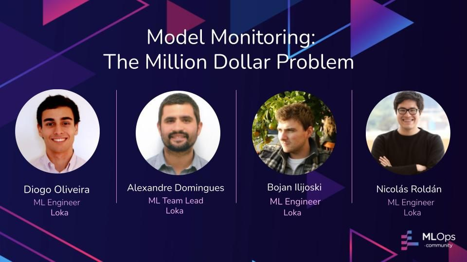

# MLOps Community Meetup: Model Monitoring: The Million Dollar Problem

Repository for the MLops Meetup on the 24th November 2021 Model Monitoring: The Million Dollar Problem by Loka team.

In order, demos shown in the video are the following:

## 1. SageMaker Model Monitoring

Explains how you can train an ML model, generate a baseline (for comparison) and creating a quality monitoring job using SageMaker. This [Jupyter notebook](sagemaker_model_monitor_demo.ipynb) is intended to be executed in a SageMaker studio notebook instance.

## 2. Whylogs

Code serves an ML model locally using flask and how you can add observability to your model predictions using [whylogs](https://github.com/whylabs/whylogs) Python module. Video further explains how you can generate comparisons between data profiles using `whylabs` paid platform.

A _data profile_ is a set of summary statistics, so what is actually sent to platform are statistics of your data rather than your data itself.

Go to [whylogs notebook](whylogs/whylogs_demo.ipynb) to check the demo.

_Note_: this demo can't be replicated without having a whylabs API key and account.

## 3. Evidently.ai

This code demonstrates how to use [evidently.ai](https://evidentlyai.com/) open source package to generate different reports to detect changes between two distributions (testing and training) used to evaluate data drifting, target drifting among others.

Go to [evidently notebook](evidently_demo.ipynb) to check the demo.

## Youtube Video

